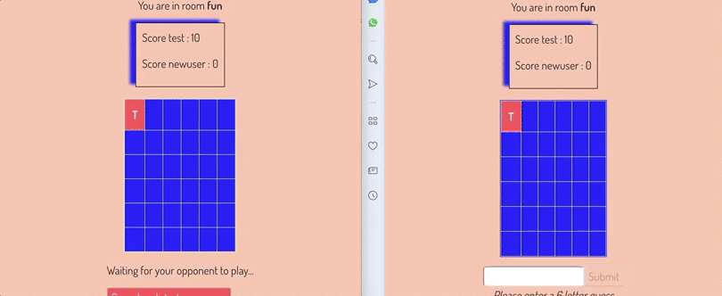

## Lingo - an online word game

Check out the remotely-hosted [website](https://lingogame.netlify.com/)!

## Table of contents

- [Preface](#Preface)
- [How to start](#How-to-start)
- [Technologies used for this project](#Technologies-used-for-this-project)
- [Contributors](#Contributors)

## Preface

Lingo is a word game played between two players.
The players need to enter a game room. At the start of the game, the players are shown the first letter of a 6-letter word. The goal of the game is for the players to guess the six letter word. Each of them gets 3 chances to guess the word. For each guess, the application shows a red square for every letter in the right position, yellow square for every letter in the wrong position and blue square for letters that don't belong to the word.
The first player to guess the word wins.

Here's a little demo...

## How to start

1. Clone the git repository into a new directory on your computer: `git clone git@github.com:LavanyaJay/game-client.git`
2. Run `npm install` on your terminal to install all the dependendencies
3. Run `npm start` to get a preview of the front-end

**_HAVE FUN!!!_**

## Technologies used for this project

1. React with `create-react-app`
2. `redux` and `react-redux` to set up a redux store and dispatch actions
3. `react-router` and `react-router-dom` to use routes in react and have dom elements that work with them
4. `superagent` to fetch data from the database
5. `redux-thunk` to dispatch actions for the redux store

## Contributors

- Lavanya Jayapalan | [Github](https://github.com/LavanyaJay)
- Manon Bosselut | [Github](https://github.com/mbosselut)
